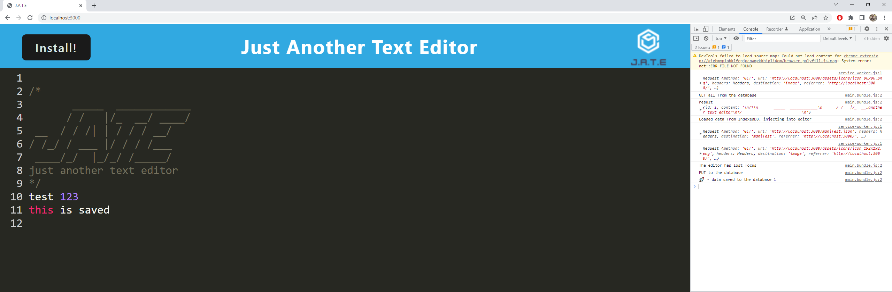

# W19 - PWA Jate - Text Editor

## Table of Content 
  - [Table of Content](#table-of-content)
  - [Description](#description)
  - [Installation](#installation)
  - [Usage](#usage)
  - [Deployed Application](#deployed-application)
  - [Questions](#questions)

## Description
This application allows the user to type and edit their text in this text editor. The application saves their text and for their next use and the user can also install this application. I used multiple new technologies and structures such as webpack, service worker and client/server structure. The challenges I faced where understanding how the service worker works. Also what properties I need to use in the plugins of my webpack file. Caching was also a little difficult to write out Syntax-wise, the base concept however makes sense. 

## Installation
- `Clone the repo to your local machine`
- `open terminal in root directory`
- `type: npm i` 
- `after dependencies have installed `
- `type: npm run start dev` 

## Usage
- you may use this JATE as you see fit  for text and record keep or just regular note taking

## Deployed Application
[insert heroku link here](https://[insertlinkhere].herokuapp.com/)

## Questions
Feel free to contact me, or explore my GitHub Profile Here: [Github](https://github.com/JRoberts94)
 
otherwise email me at: jake.shaun.roberts1994@gmail.com